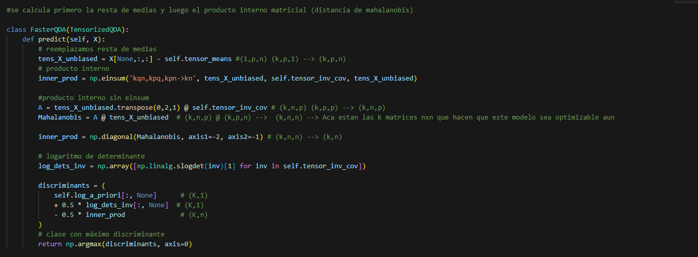
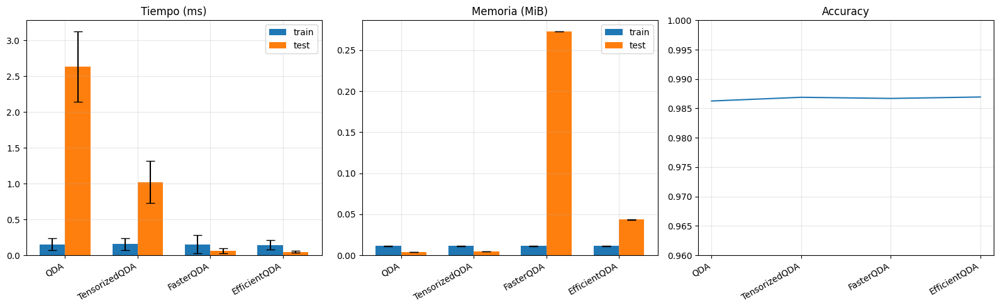
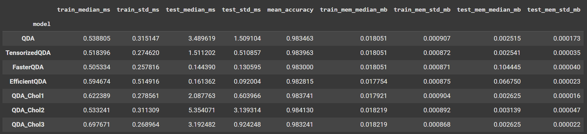
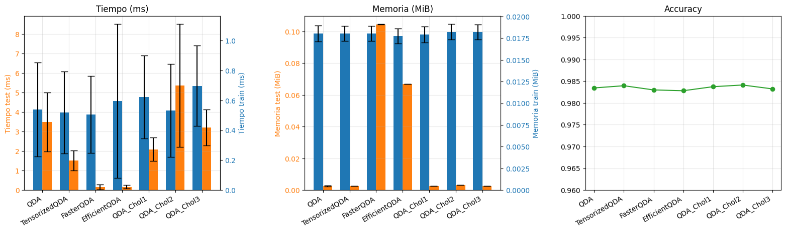
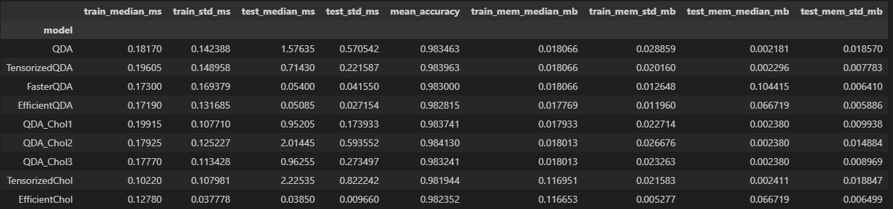
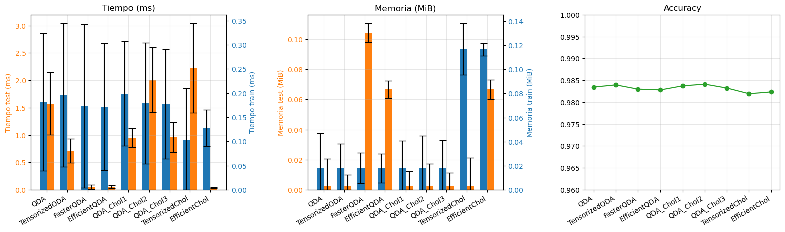
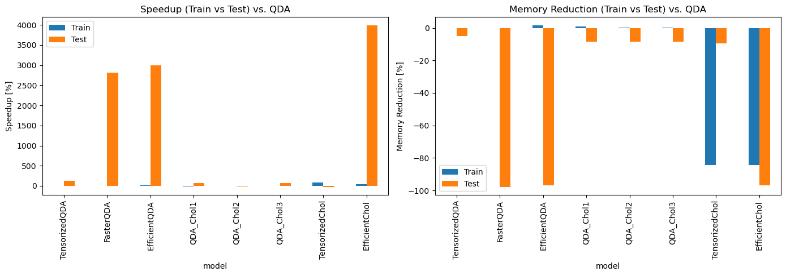

# Consigna QDA

**Notación**: en general notamos

* $k$ la cantidad de clases
* $n$ la cantidad de observaciones
* $p$ la cantidad de features/variables/predictores

## Tensorización

En esta sección nos vamos a ocupar de hacer que el modelo sea más rápido para generar predicciones, observando que incurre en un doble `for` dado que predice en forma individual un escalar para cada observación, para cada clase. Paralelizar ambos vía tensorización suena como una gran vía de mejora de tiempos.

### 1) Diferencias entre `QDA`y `TensorizedQDA`

1. **¿Sobre qué paraleliza `TensorizedQDA`? ¿Sobre las $k$ clases, las $n$ observaciones a predecir, o ambas?**

    Paraleliza sobre las k clases, porque a pesar de formar un tensor de dimensiones $(k, p, p)$ para la matriz de covarianzas y uno de $(k, p, 1)$ para el tensor de medias de las features, de todas formas cada observación se evalua individualmente con el método `_predict_one`.

2. **Analizar los shapes de `tensor_inv_covs` y `tensor_means` y explicar paso a paso cómo es que `TensorizedQDA` llega a predecir lo mismo que `QDA`.**
    
    Los shapes de los tensores son: 
    * `tensor_inv_covs`: $(k, p, p)$
    * `tensor_means`: $(k, p, 1)$
  
    La predicción se realiza de forma equivalente porque:
    
    1. Durante el entrenamiento, `TensorizedQDA` apila las matrices de covarianza invertidas y las medias en tensores usando `np.stack`, creando una dimensión adicional para las `k` clases.
    
    2. En la predicción, para cada observación `x`, calcula:
       - Resta las medias de cada clase: `unbiased_x = x - self.tensor_means` (shape: `(k, p, 1)`)
       - Transpone para obtener la forma adecuada: `unbiased_x.transpose(0,2,1)` (shape: `(k, 1, p)`)
       - Calcula el producto matricial para todas las clases simultáneamente: `inner_prod = unbiased_x.transpose(0,2,1) @ self.tensor_inv_cov @ unbiased_x` (shape: `(k, 1, 1)`)
       - Calcula `0.5*np.log(LA.det(self.tensor_inv_cov)) - 0.5 * inner_prod.flatten()` para obtener los logaritmos de las probabilidades condicionales
    
    3. Finalmente, suma estos valores con los logaritmos de las probabilidades a priori y selecciona la clase con mayor probabilidad posterior, exactamente igual que `QDA` pero calculando todas las clases en paralelo.

### 2) Optimización

Debido a la forma cuadrática de QDA, no se puede predecir para $n$ observaciones en una sola pasada (utilizar $X \in \mathbb{R}^{p \times n}$ en vez de $x \in \mathbb{R}^p$) sin pasar por una matriz de $n \times n$ en donde se computan todas las interacciones entre observaciones. Se puede acceder al resultado recuperando sólo la diagonal de dicha matriz, pero resulta ineficiente en tiempo y (especialmente) en memoria. Aún así, es *posible* que el modelo funcione más rápido.

3. **Implementar el modelo `FasterQDA` (se recomienda heredarlo de `TensorizedQDA`) de manera de eliminar el ciclo for en el método predict.**
   
   
   Ver en [notebook](../notebooks/AMIA_2025_TP1.ipynb)
4. **Mostrar dónde aparece la mencionada matriz de $n \times n$, donde $n$ es la cantidad de observaciones a predecir.**

5. **Demostrar que:**

    $$
    diag(A \cdot B) = \sum_{cols} A \odot B^T = np.sum(A \odot B^T, axis=1)
    $$
    es decir, que se puede "esquivar" la matriz de $n \times n$ usando matrices de $n \times p$. 

    También se puede usar, de forma equivalente,
    $$
    np.sum(A^T \odot B, axis=0).T
    $$
    queda a preferencia del alumno cuál usar.

    [Demostración](../docs/demostracion_amia_tp1_ej5.pdf)

6. **Utilizar la propiedad antes demostrada para reimplementar la predicción del modelo `FasterQDA` de forma eficiente en un nuevo modelo `EfficientQDA`.**

    Resuelto en [notebook](../notebooks/AMIA_2025_TP1.ipynb).

7. **Comparar la performance de las 4 variantes de QDA implementadas hasta ahora (no Cholesky) ¿Qué se observa? A modo de opinión ¿Se condice con lo esperado?**

    Resultados con:

        Python 3.12.7
        numpy==2.0.2
        scipy==1.16.1

    

    Podemos ver en estos gráficos que en Train no se ve diferencia alguna entre las implementaciones. En Test por otro lado vemos tiempos mucho mas grandes en el `QDA` baseline e incluso el `TensorizedQDA`, con el mas corto siendo el `EfficientQDA`. 

    En términos de uso de memoria `FasterQDA` es, considerablemente, el más problemático debido a su cálculo de matrices nxn. Esto se ve bastante amortiguado con la implementación realizada en `EfficientQDA`. 

    Por último, en terminos de accuracy, los 4 modelos se mueven dentro de un rango muy similar, por lo que no se destacan grandes diferencias en esto. 

### 3) Diferencias entre implementaciones de `QDA_Chol`

8. **Si una matriz $A$ tiene fact. de Cholesky $A=LL^T$, expresar $A^{-1}$ en términos de $L$. ¿Cómo podría esto ser útil en la forma cuadrática de QDA?**
    
    En QDA, la forma cuadrática es  

    $$
    (x-\mu)^\top \Sigma^{-1} (x-\mu).
    $$

    Si $\Sigma = LL^\top$, no conviene invertir $\Sigma$ explícitamente. En su lugar, resolvemos sistemas triangulares:  

    $$
    v = L^{-1}(x-\mu), \qquad
    (x-\mu)^\top \Sigma^{-1} (x-\mu) = \|v\|_2^2.
    $$

    Esto es útil porque evitamos calcular la matriz inversa de covarianzas explicitamente. 

9.  **Explicar las diferencias entre `QDA_Chol1`y `QDA` y cómo `QDA_Chol1` llega, paso a paso, hasta las predicciones.**

    La diferencia entre ambos esta en:
    
    - En el método `_fit_params`: al calcular la matriz de covarianzas, se calcula utilizando Cholesky y solo tomando la matriz inferior de esta (lower=true). 
    
            LA.inv(cholesky(np.cov(X[:,y.flatten()==idx], bias=True), lower=True))
    - En el método `_predict_log_conditionals`: como ya utilizamos Cholesky y tenemos la matriz inferior de la matriz de covarianzas (L) invertida (L_inv), podemos utilizar esto para reemplazar 

            np.log(L_inv.diagonal().prod()) -0.5 * (y**2).sum()

    $$
    y = L^{-1}(x-\mu), \qquad
    (x-\mu)^\top \Sigma^{-1} (x-\mu) = \|y\|_2^2.
    $$

    

10. **¿Cuáles son las diferencias entre `QDA_Chol1`, `QDA_Chol2` y `QDA_Chol3`?**

    En la forma que resuelven el Cálculo Matricial:

    - `QDA_Chol1` calcula la descomposición de Cholesky y luego invierte explícitamente la matriz usando LA.inv() de NumPy.
    - `QDA_Chol2` almacena el factor de Cholesky L directamente sin inversión
    - `QDA_Chol3` utiliza la función dtrtri de LAPACK para calcular la inversa del factor triangular de Cholesky, lo que es numéricamente más estable y eficiente que la inversión general de matrices.

    En la forma que resuelven el Cálculo de Predicción:

    - `QDA_Chol1` y `QDA_Chol3` ambos utilizan multiplicación matricial con el factor inverso de Cholesky precalculado.
    - `QDA_Chol2` utiliza *solve_triangular* para resolver el sistema `Ly = unbiased_x` en lugar de calcular la inversa explícitamente. El signo del término del logaritmo del determinante es negativo porque está usando L en lugar de L⁻¹.

    Conclusión:
    - `QDA_Chol1`: Implementación más directa pero menos eficiente debido a la inversión explícita de matrices generales.
    - `QDA_Chol2`: Evita la inversión explícita de matrices mediante el uso de *solve_triangular*, que es numéricamente más estable y eficiente para matrices triangulares, por lo que probablemente sea el más eficiente en memoria ya que no almacena matrices invertidas.
    - `QDA_Chol3`: Utiliza la función especializada dtrtri de LAPACK para la inversión de matrices triangulares, que resulta ser más eficiente que la inversión general de matrices pero aún precalcula la inversa (a diferencia de QDA_Chol2). Probablemente ofrezca el mejor equilibrio entre velocidad y estabilidad numérica.

11. **Comparar la performance de las 7 variantes de QDA implementadas hasta ahora ¿Qué se observa?¿Hay alguna de las implementaciones de `QDA_Chol` que sea claramente mejor que las demás?¿Alguna que sea peor?**

    Resultados con

        Python 3.12.11
        numpy==2.0.2
        scipy==1.16.1

    

    

    En base a las ejecuciones realizadas notamos los siguientes puntos: 

    - En Tiempo:
      - Train: No parece haber grandes mejoras respecto al resto de modelos. De las implementaciones QDA_Chol, la mejor parece ser `QDA_Chol2`.
      - Test: Implementaciones tensorizadas (`TensorizedQDA`, `FasterQDA`, `EfficientQDA`) siguen siendo considerablemente superiores en tiempo consumido. 
    - En memoria: 
      - Train: Todos los modelos se manejan en el mismo rango y con desvios estandar similares. 
      - Test: Se mantiene la tendencia de consumo de memoria exponencialmente superior en ``FasterQDA`` y ``EfficientQDA``. 
    
    Con estos datos, podemos decir que `QDA_Chol3` presenta resultados peores al resto de iteraciones basadas en Cholesky. En cambio, para avanzar con el resto del proyecto, se elige `QDA_Chol2` como base para tensorizar y eficientizar esta debido a sus resultados superiores. 

### 4) Optimización

12. **Implementar el modelo `TensorizedChol` paralelizando sobre clases/observaciones según corresponda. Se recomienda heredarlo de alguna de las implementaciones de `QDA_Chol`, aunque la elección de cuál de ellas queda a cargo del alumno según lo observado en los benchmarks de puntos anteriores.**

    Ver en [notebook](../notebooks/AMIA_2025_TP1.ipynb). --> Esta implementación está tensorizada parcialmente ya que el método `cholensk()` de SciPy aparentemente no admite tensores, por lo que habría que utilizar otras librerías como Torch. Creo que esto haría que ya no sean comparables los métodos entre si, por lo que se decide tensorizar parcialmente. 

13. **Implementar el modelo `EfficientChol` combinando los insights de `EfficientQDA` y `TensorizedChol`. Si se desea, se puede implementar `FasterChol` como ayuda, pero no se contempla para el punto.**

    Ver en [notebook](../notebooks/AMIA_2025_TP1.ipynb).

14. **Comparar la performance de las 9 variantes de QDA implementadas ¿Qué se observa? A modo de opinión ¿Se condice con lo esperado?**

    Resultados con 

        Python 3.12.7
        numpy==2.0.2
        scipy==1.16.1

    

    

    Con estos resultados podemos ver que:
    - En tiempo:
      - Para entrenamiento: El método mas eficiente fue ``TensorizedChol``, con ``EfficientChol`` relativamente cerca pero afectado por el resto de su implementación. 
      - Para test: Se observa que tanto `FasterQDA`, `EfficientQDA` como `EfficientChol` llegan a resultados similares.
    - En terminos de memoria: 
      - Para entrenamiento: vemos que tanto ``TensorizedChol`` como ``EfficientChol`` ahora utilizan la memoria para reducir los tiempos de entrenamiento, llegando a niveles similares a los utilizados para test por los metodos tensorizados vistos al comienzo de este trabajo. 
      - Para test: Notamos como ``EfficientChol`` consume memoria en un rango similar a `EfficientQDA`. 

    Adicionalmente, podemos ver los resultados relativos a ``QDA`` como benchmark:

    

    Como conclusión, vemos que la última implementación `EfficientChol`, si bien consume mucha memoria logra mezclar las 2 "tácticas" de mejora del modelo de clasificación QDA. Sacrificando un poco su tiempo de entrenamiento pero logrando tiempos de test muy buenos. 

    En terminos de accuracy, todos los modelos se comportaron dentro del rango esperado: similar. 

    

