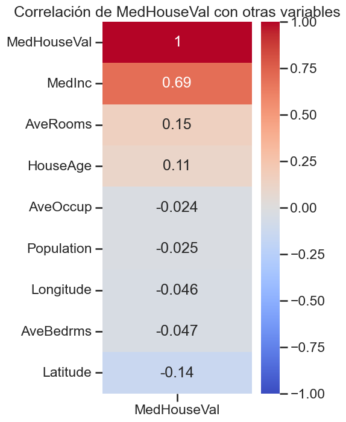
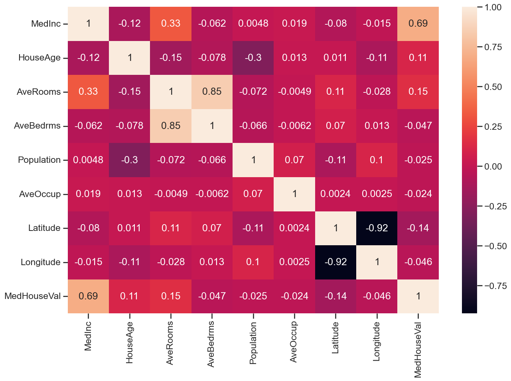
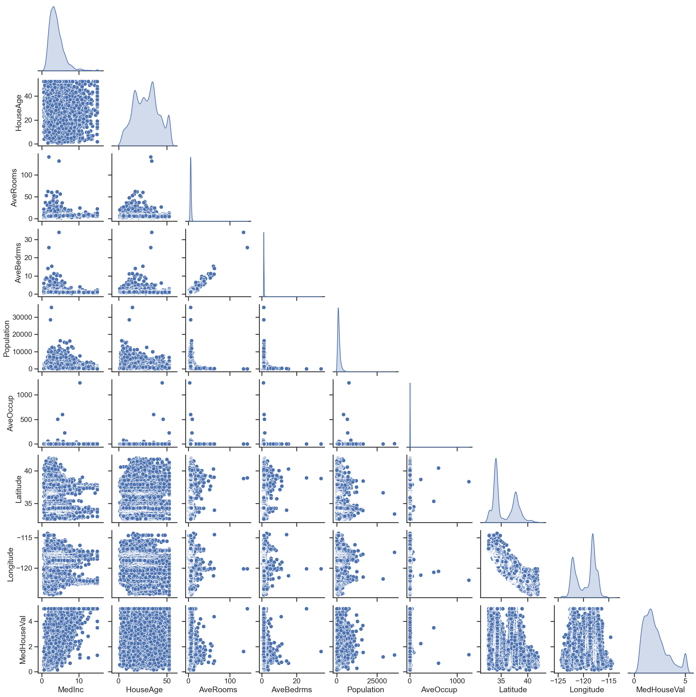
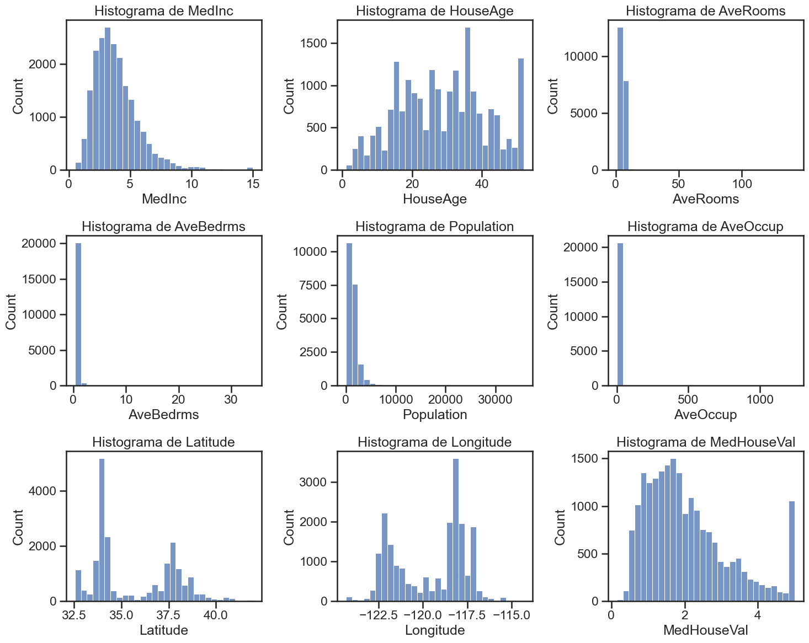
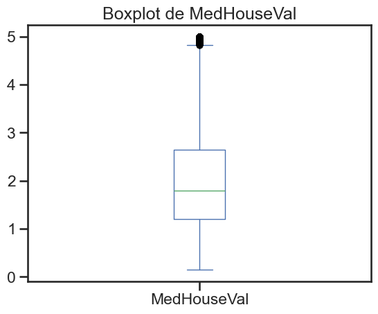
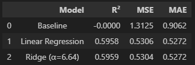
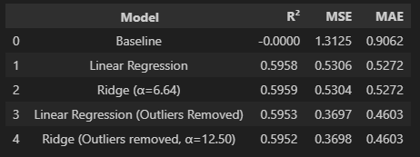

# Regresión del valor de valor medio de casas en distritos de California

### Descripción de la Implementación

### Preguntas a Resolver

#### 1. Obtener la correlación entre los atributos y entre los atributos y el target.

1. **¿Qué atributo tiene mayor correlación lineal con el target?** 
    Los atributos con más correlación es **MedInc** (el ingreso medio en el bloque), seguido por bastante diferencia por **AveRooms** (Promedio de habitaciones por hogar) y luego **Latitude**. 

        
     
2. **¿Cuáles atributos parecen estar más correlacionados entre sí? Se pueden calcular los coeficientes de correlación o representarlos gráficamente mediante un mapa de calor?** 
    Se pueden representar el mapa de calor a traves del cual se ven los atributos que estan mas correlacionados entre si:
    
    

    Latitude y Longitude -> -0.92: Se da debido a la distribución en el mapa del estado de California. 
    AveRooms y AveBedrms -> 0.85: Tampoco es casual ya que el AveBedrms esta directamente relacionado con el AveRooms, a mayor AveBedrms mayor AveRooms.
    MedInc y MedHouseVal -> 0.69: Indica que a mayor ingredo medio mayor valor medio de la casa.
    MedInc y AveRooms -> 0.33: Similar al caso anterior a mayor ingreso mayor numero de habitaciones
    Population y HouseAge -> -0.30: Zonas con casas más antiguas suelen tener menor población (o viceversa).

    Podemos además ver estas distribuciones en un pairplot: 
    

#### 2. Graficar los histogramas de los distintos atributos y del target. 

1. **¿Qué forma presentan los histogramas?** 
    *MedInc:* Sesgo a la derecha (asimetría positiva): mayoría de observaciones en valores bajos-medios (2–6) y cola larga hacia ingresos altos, pocas zonas muy ricas elevan el extremo derecho (outliers muy pronunciadoss).
    *HouseAge:* Distribución multimodal y algo más plana que una normal.
    *AveRooms:* Sesgo a la derecha muy pronunciado, con valores extremos altísimos (outliers), algunas zonas tienen promedios muy altos por viviendas poco comunes.
    *AveBedrms:* Distribución muy concentrada cerca de valores bajos (~1), con pocos outliers.
    *Population:* Alta asimetría positiva: muchas zonas con poca población, pero hay unas pocas muy densos.
    *AveOccup:* Muy sesgada a la derecha: muchas zonas con ocupación baja (~2–4), pero hay casos extremos.
    *MedHouseVal:* Sesgo a la derecha, aunque menos extremo que ingresos.
    *Latitude y Longitude:* Reflejan la distribución geográfica del dataset (picos en ubicaciones concretas, como ciudades grandes).

2. **¿Alguno muestra una distribución similar a una campana que sugiera una distribución gaussiana, sin necesidad de realizar pruebas de hipótesis?**
    House age parece distribuirse aproximadamente como una distribución normal, sin embargo no representa una campana suave lo que demuestra que han habido años concretos con mayor numero de construcciones.
    Por otro lado MedInc y MEdHouseVal parecen tener una distribución sesgada a la derecha, con la particularidad de MedHouseVal de tener alta cantidad de valores en el rango superior, que va a mover la media considerablemente y probablemente afecte el resultado de la regresión.

#### 3. Calcular una regresión lineal utilizando todos los atributos.

1. **Con el conjunto de entrenamiento, calcular la varianza total de los datos y la varianza explicada por el modelo.** 
    Varianza total de los datos (TSS): 19355.93
    Varianza explicada por el modelo (ESS): 11794.46
    Varianza residual (RSS): 7561.471021289253

2. **¿Está el modelo capturando adecuadamente el comportamiento del target? Fundamente su respuesta.**
    Dadas la varianza total y la varinza explicada por el modelo podemos obtener el coeficiente de Pearson:
    R2 = TSS / ESS
    R2 = 19355.93 / 11794.46
    R2 = 0.609

    Este indica que hay 60% de variabilidad del target, es un ajuste moderado, podria aceptarse debido a la variabilidad respecto al mercado inmobiliario en el paso del tiempo.

#### 4. Calcular las métricas de MSE, MAE y R² sobre el conjunto de evaluación.

    MSE scores: [0.54787556 0.500835   0.52045639 0.51612252 0.54883741]
    MAE scores: [0.54382663 0.52543174 0.52276044 0.52805288 0.5393325 ]
    R2 scores: [0.60488715 0.6034532  0.61703246 0.61092899 0.59661709]

    Promedios:
    MSE promedio: 0.5268253746355749
    MAE promedio: 0.5318808372496995
    R2 promedio: 0.6065837773699929

#### 5. Crear una regresión de Ridge. 

1. **Usar validación cruzada de 5 folds y tomar como métrica el MSE.**
    Ejecutado en código en notebook.

2. **Buscar el mejor valor de α en el rango [0, 12.5].**
    Mejor alpha: 6.637

3. **Graficar el MSE en función de α.**

    MSE promedio con mejor alpha: 0.5268175785432091
    

#### 6. Comparar los resultados obtenidos entre la regresión lineal y la mejor regresión de Ridge, evaluando el conjunto de prueba.

1. **Cuál de los dos modelos obtiene mejores resultados en términos de MSE y MAE? ¿Poseen suficiente diferencia como para indicar si uno es mejor que el otro?**
    
        
    Como se observa en la tabla, ambos modelos arrojan resultados similares. Si bien bastante superiores al baseline de comparación (media como aproximación), no presentan grandes diferencias entre ellos. 

2. **¿Qué tipo de error podría haberse reducido?**
    El error que se debería reducir es el MSE, ya que la búsqueda de alfa consiste en buscar el punto en el que el error por varianza y el error por sesgo intersectan, dando un MSE mínimo. Se presenta una reducción, pero es mínima. 

## Análisis adicional

Con el fin de explorar una posibilidad de mejora del modelo se evalua que pasaría utilizando los modelos pero retirando los outliers del dataset antes de entrenarlo:

Retirando los outliers, cambiamos el dataset a: 

    Cantidad con outliers: 20640
    Cantidad sin outliers: 19569

Con este nuevo dataset, entrenamos los modelos nuevamente, y lo ponemos a prueba contra el set de test: 

Con estos nuevos  modelos se reduce el MSE y MAE, probablemente porque, si recordamos la distribución de MedHouseVal, estamos reduciendo el impacto que tienen en la regresión los datos acumulados en el extremo superior de los valores. 

Si bien esto reduce el error del modelo, empeoraría su capacidad de predecir estos precios extremos. 
