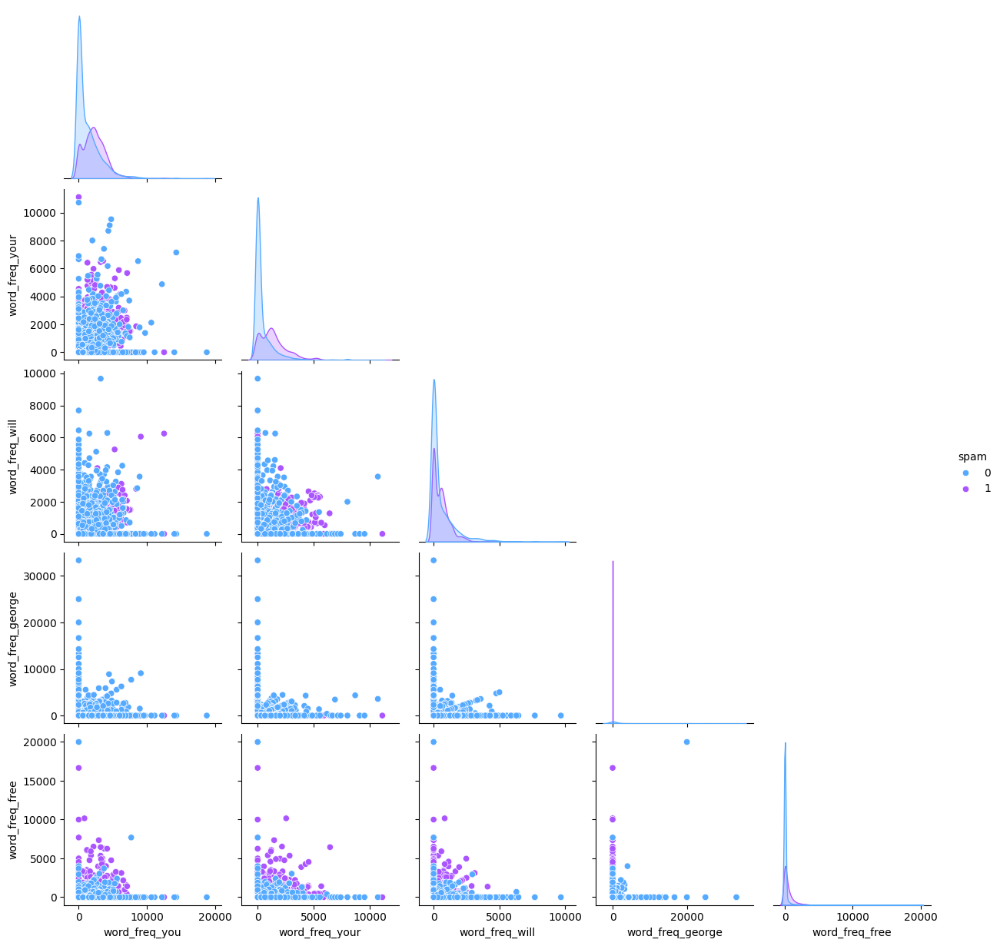
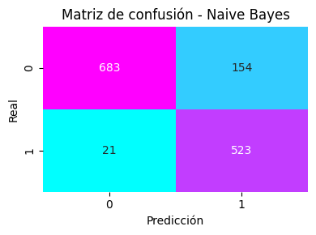
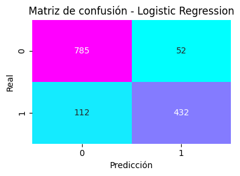
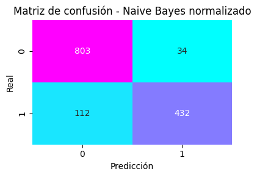
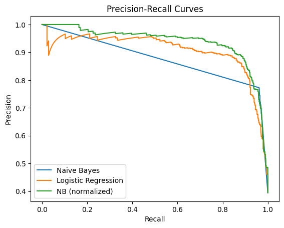
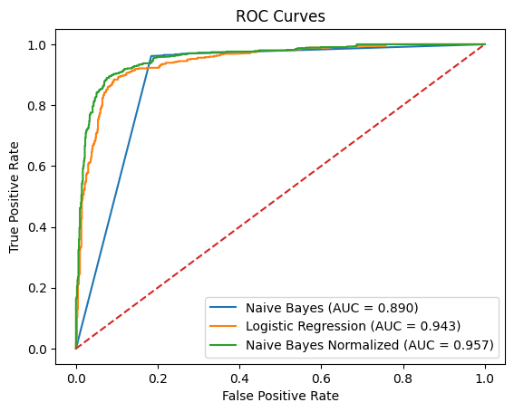

# Detector de SPAM

### Descripción de la Implementación

Este notebook implementa un modelo de Regresión Logística y un modelo Naive Bayes (con y sin normalización) para clasificar si un correo es SPAM o NO SPAM, utilizando el dataset [spambase](../datasets/spambase.csv).

El desarrollo se encuentra completamente contenido en la notebook [spam_detection_solution.ipynb](../notebooks/spam_detection_solution.ipynb), organizada en secciones que permiten seguir el flujo de trabajo desde la carga de datos hasta la evaluación final de los modelos.

Las principales características de esta implementación son:

- **Carga y preprocesamiento de datos** mediante `pandas` y `scikit-learn`.  
- **Análisis exploratorio de datos (EDA)** con visualizaciones y estadísticas descriptivas.  
- **Entrenamiento de modelos de regresión logística y Naive Bayes (con y sin normalización)** y comparación de su rendimiento.  
- **Evaluación del modelo** mediante la *Matriz de confusión*, y usando métricas como *Sensibilidad*, *Especificidad*, *Exactitud Balanceada*, *Precisión*, *Recall* y *puntaje F1*.  
- **Visualización de resultados** Visualización de la *Curva ROC* y *AUC* para cada modelo. 

### Preguntas a Resolver

#### 1. ¿Cuáles son las 10 palabras o símbolos más frecuentes en correos SPAM y en correos NO SPAM?

##### 10 palabras o símbolos más frecuentes en correos SPAM

| # | feature            | total_frequency_in_spam |
|---|--------------------|-------------------------|
| 0 | word_freq_you      | 4105599                 |
| 1 | word_freq_your     | 2502597                 |
| 2 | word_freq_will     | 997100                  |
| 3 | word_freq_free     | 939790                  |
| 4 | word_freq_our      | 931799                  |
| 5 | char_freq_!        | 931352                  |
| 6 | word_freq_all      | 732080                  |
| 7 | word_freq_mail     | 635470                  |
| 8 | word_freq_email    | 578759                  |
| 9 | word_freq_business | 521250                  |

##### 10 palabras o símbolos más frecuentes en correos NO SPAM (ham)

| # | feature            | total_frequency_in_ham |
|---|--------------------|------------------------|
| 0 | word_freq_you      | 3541702                |
| 1 | word_freq_george   | 3527559                |
| 2 | word_freq_hp       | 2496576                |
| 3 | word_freq_will     | 1495268                |
| 4 | word_freq_your     | 1223098                |
| 5 | word_freq_hpl      | 1204398                |
| 6 | word_freq_re       | 1159138                |
| 7 | word_freq_edu      | 800669                 |
| 8 | word_freq_address  | 681569                 |
| 9 | word_freq_meeting  | 604460                 |

1. **¿Hay palabras o símbolos en común?**

Si, se detecta que las palabras `you`, `your` y `will` se encuentran en el top 10 de frecuencia tanto en correos SPAM como en NO SPAM.

| # | feature        | total_frequency_in_spam | total_frequency_in_ham |
|---|----------------|-------------------------|------------------------|
| 0 | word_freq_you  | 4105599                 | 3541702                |
| 1 | word_freq_your | 2502597                 | 1223098                |
| 2 | word_freq_will | 997100                  | 1495268                |

2. **¿Alguna resulta llamativa?**

Sí, al analizar los términos se observan patrones interesantes:

- En **SPAM** aparecen palabras directamente asociadas a mensajes comerciales o de engaño, como `free`, `business`, `our`, así como el símbolo `!`, que suele utilizarse para llamar la atención en títulos de ofertas o promociones.  
- En **NO SPAM (ham)** destacan términos vinculados al ámbito corporativo y académico, como `george`, `hp`, `hpl`, `edu`, `meeting`, y `address`. Esto sugiere que gran parte de los correos legítimos en el dataset provienen de un contexto empresarial o institucional.  
- También resulta llamativo que palabras muy genéricas como `you`, `your` y `will` sean frecuentes en ambas clases. Esto indica que por sí solas no son buenos discriminadores, y que el modelo debe apoyarse en combinaciones de atributos para clasificar correctamente.

Además, la siguiente visualización (pairplot) permite observar cómo se distribuyen algunas de las palabras más frecuentes según la clase. 
Se aprecia, acorde a lo explicado anteriormente, qué términos como `you`, `your` y `will` aparecen tanto en correos SPAM como en NO SPAM, lo que explica su poca capacidad de discriminación individual. 
Por el contrario, la palabra `george` está fuertemente asociada a correos legítimos, mientras que `free` se concentra en correos SPAM. 
Este análisis gráfico refuerza la importancia de utilizar un conjunto amplio de atributos en lugar de depender de palabras aisladas.

#### 2. Separe el conjunto de datos en un conjunto de entrenamiento (70%) y uno de prueba (30%).
Ejecutado en código en notebook.

#### 3. Utilizando un clasificador de Bayes ingenuo, entrene el modelo con el conjunto de entrenamiento.
Ejecutado en código en notebook.

#### 4. Utilizando un clasificador de Regresión Logística, entrene el modelo con el conjunto de entrenamiento (en este caso, normalice los datos).
Ejecutado en código en notebook.

#### 5. Calcule la matriz de confusión en el conjunto de prueba para ambos modelos.

1. **¿Qué tipo de error comete más cada modelo?**

Recordando que:

* Verdadero positivo (TP): Son las observaciones que clasificamos como 1 y
que realmente eran 1.
* Verdadero negativo (TN): Son las observaciones que clasificamos como 0 y
que realmente eran 0.
* Falso positivo (FP): Son las observaciones que clasificamos como 1 y que
realmente eran 0. Este error se llama de tipo I.
* Falso negativo (FN): Son las observaciones que clasificamos como 0 y que
realmente eran 1. Este error se llama de tipo II

**Naive Bayes (sin normalizar)**

**Error más común**: Error tipo I - Falsos Positivos (FP) → correos legítimos clasificados como SPAM.
Esto implica que usuarios podrían perder mensajes válidos en la carpeta de spam.

**Regresión Logística**

**Error más común**: Error tipo II - Falsos Negativos (FN) → correos SPAM que pasan como legítimos.
Esto implica que los usuarios recibirán más SPAM en su bandeja principal.

**Naive Bayes Normalizado**

**Error más común**: Error tipo II - Falsos Negativos (FN) → correos SPAM que pasan como legítimos.
Esto implica que los usuarios recibirán más SPAM en su bandeja principal.

2. **¿Cuál de los dos tipos de error considera más importante en este problema?**

Consideramos que el error más crítico es el tipo I: Falso Positivo (FP). 
La razón principal es que un correo legítimo marcado como SPAM puede implicar la pérdida de información sensible y relevante para el usuario, como ofertas laborales, mensajes académicos o comunicaciones familiares. Estos correos, al quedar ocultos en la carpeta de SPAM, corren un alto riesgo de no ser revisados a tiempo o incluso de perderse por completo, generando un deterioro en la confianza del usuario hacia el sistema de filtrado.
En cambio, si bien los falsos negativos permiten que cierto SPAM llegue a la bandeja de entrada, el impacto suele ser menor, ya que el usuario puede identificar y eliminar dichos correos manualmente. Por lo tanto, desde la perspectiva de usabilidad y confianza en el sistema, se prioriza minimizar los falsos positivos, aun si esto implica aceptar un número algo mayor de falsos negativos.

#### 6. Calcule las métricas de precisión (precision) y recuperación (recall) para ambos modelos.

1. **¿Cuál es el mejor modelo según cada métrica?**

De acuerdo a los resultados obtenidos:

- **Naive Bayes (sin normalizar)**
  - Precisión (SPAM): **0.77**
  - Recall (SPAM): **0.96**

- **Regresión Logística**
  - Precisión (SPAM): **0.89**
  - Recall (SPAM): **0.79**

- **Naive Bayes Normalizado**
  - Precisión (SPAM): **0.93**
  - Recall (SPAM): **0.79**

**Comparación:**
- Según **recuperación (recall)**, el mejor modelo es el **Naive Bayes (sin normalizar)** (0.96).  
- Según **precisión**, el mejor modelo es el **Naive Bayes normalizado** (0.93).  
- La **Regresión Logística** queda en un punto intermedio, con buena precisión (0.89) y un recall similar al NB normalizado (0.79).  

2. **¿Cómo se relacionan estas métricas con los errores analizados en el punto anterior?**

- **Naive Bayes (sin normalizar)** logra el **mayor recall (0.96)**, lo que significa que detecta casi todos los correos SPAM, pero a costa de una **precisión más baja (0.77)**. Esto coincide con lo observado en las matrices de confusión: comete más **Falsos Positivos (FP)**, clasificando correos legítimos como SPAM.  

- **Regresión Logística** y **Naive Bayes normalizado** muestran un **recall menor (0.79)**, es decir, se les escapan más correos SPAM (**Falsos Negativos, FN**). Sin embargo, mejoran la **precisión** (0.89 y 0.93 respectivamente), lo que significa que los correos que marcan como SPAM son más confiables.  

En conclusión, las métricas reflejan el mismo trade-off discutido anteriormente:  
- **Naive Bayes (sin normalizar)** prioriza la **recuperación de SPAM** (minimiza FN), sacrificando confianza en los positivos (más FP).  
- **Naive Bayes normalizado** prioriza la **precisión** (minimiza FP), sacrificando recall (más FN).  
- **Regresión Logística** se ubica entre ambos, ofreciendo un equilibrio aceptable pero sin destacar como el mejor en ninguna de las métricas principales.  

El análisis de las métricas puntuales se complementa con las curvas Precision–Recall. 

Estas curvas muestran el comportamiento de cada modelo al variar el umbral de decisión. 
Se observa que el Naive Bayes (sin normalizar) logra altos niveles de recall, aunque con una caída pronunciada de precisión, mientras que la Regresión Logística mantiene un equilibrio más estable entre ambas métricas. 
Por su parte, el Naive Bayes normalizado domina en la mayor parte del rango, presentando la mejor relación global entre precisión y recall. 
Esto confirma que, ajustando adecuadamente el umbral, el Naive Bayes normalizado puede ser el modelo más robusto en términos de desempeño combinado.

#### 7. Obtenga la curva ROC y el AUC (Área Bajo la Curva ROC) de ambos modelos.

Los valores obtenidos para el Área Bajo la Curva (AUC) fueron:

- **Naive Bayes (sin normalizar):** 0.8903  
- **Regresión Logística:** 0.9429  
- **Naive Bayes normalizado:** 0.9570  

**Análisis:**

- El **Naive Bayes (sin normalizar)** obtiene un AUC aceptable (0.89), lo que indica un rendimiento razonable, aunque claramente inferior a los otros dos modelos.  
- La **Regresión Logística** mejora notablemente la capacidad discriminativa, alcanzando un AUC de 0.94, lo que refleja un buen balance entre tasa de verdaderos positivos y falsos positivos en distintos umbrales.  
- El **Naive Bayes normalizado** es el mejor de los tres, con un AUC de 0.96, lo que significa que presenta la mayor capacidad para separar correos SPAM de correos legítimos.  

La notable mejora de Naive Bayes al normalizar los datos se explica porque el reescalado corrige el desbalance en la contribución de las variables, ajustando mejor la estimación de las probabilidades condicionales. De esta manera, el modelo deja de estar dominado por unas pocas palabras muy frecuentes y logra un rendimiento más equilibrado, al punto de superar incluso a la regresión logística en capacidad discriminativa global (AUC).

**Conclusión:**  
El análisis de las curvas ROC y los valores de AUC confirma los hallazgos de las métricas previas: el **Naive Bayes normalizado** es el modelo más robusto y con mejor desempeño global. Su mayor AUC indica que, sin importar el umbral elegido, ofrece una capacidad de discriminación superior, consolidándose como el modelo más adecuado para la tarea de detección de SPAM.

### Conclusión General

A lo largo de este trabajo se implementaron y evaluaron tres enfoques distintos para la detección de correos SPAM: Naive Bayes sin normalizar, Regresión Logística y Naive Bayes con datos normalizados. Los resultados evidencian que cada modelo prioriza de manera diferente los tipos de error: el Naive Bayes clásico maximiza la recuperación de SPAM (alto recall) pero con un costo elevado en falsos positivos; la Regresión Logística ofrece un mayor control de falsos positivos y mejor especificidad, aunque deja pasar más SPAM a la bandeja de entrada (falsos negativos); y el Naive Bayes normalizado logra el mejor equilibrio global entre precisión y recall, alcanzando además el mayor valor de AUC en las curvas ROC.

Estos hallazgos muestran la relevancia del preprocesamiento de los datos en el desempeño de los modelos y refuerzan la necesidad de ajustar los umbrales de decisión en función de la política de errores que se desee priorizar. En este caso, el Naive Bayes normalizado se consolida como el modelo más robusto y adecuado para la tarea planteada, combinando buena capacidad de discriminación y un balance favorable entre precisión y recall.
